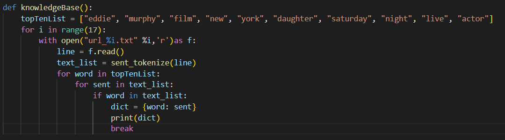

I created my knowledge base by making a dictionary making the term the key and the sentence that has the term within the sentence as the value. At the moment it is making a dictionary for all the terms in every page. So it outputs all the key and values for every page. The top 10 terms I decided to choose were: "eddie, murphy, film, new, york, daughter, saturday, night, live, and actor"

